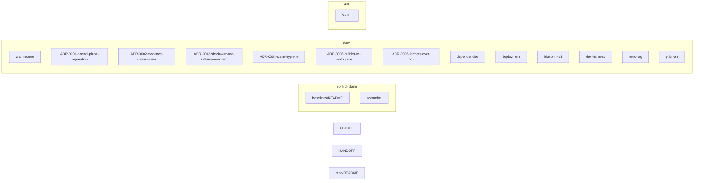

# Repository mind map (generated)

<!-- GENERATED FILE - do not edit. Regenerate: python tools/generate_mindmap.py (ADR-0006) -->

Nodes: 19 markdown files · Edges: 0 links · The link graph inside the files is the source of truth; this is only a rendered view.

